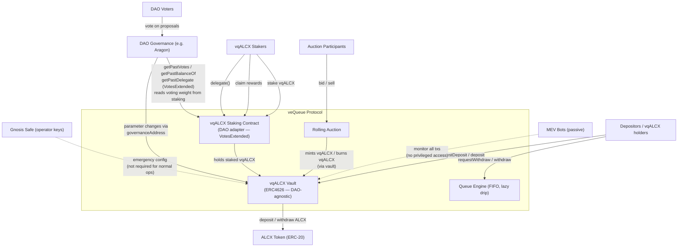
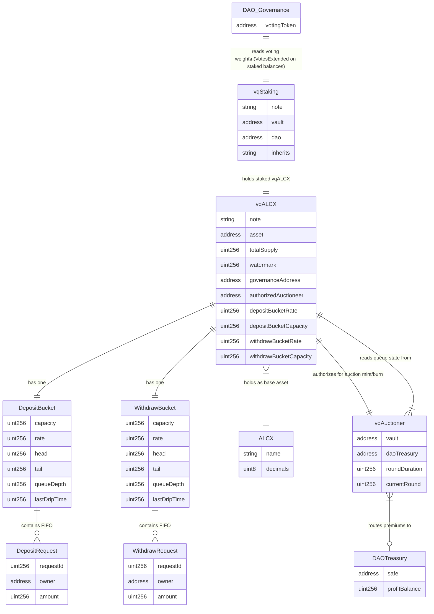
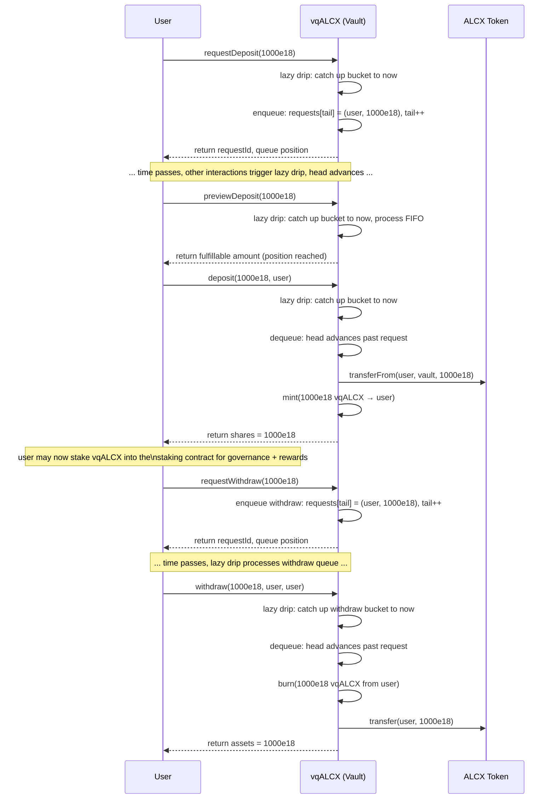
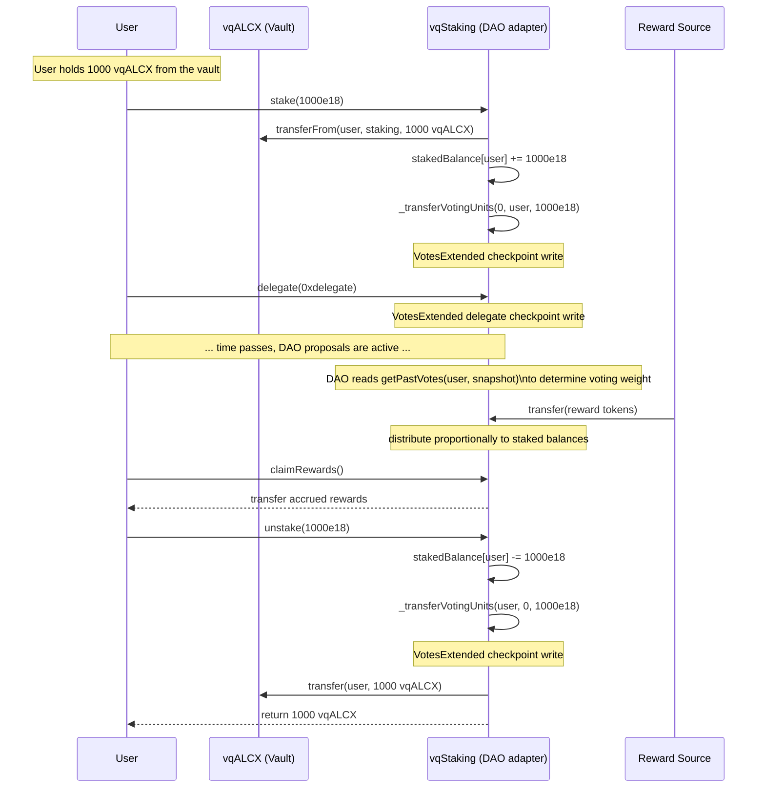
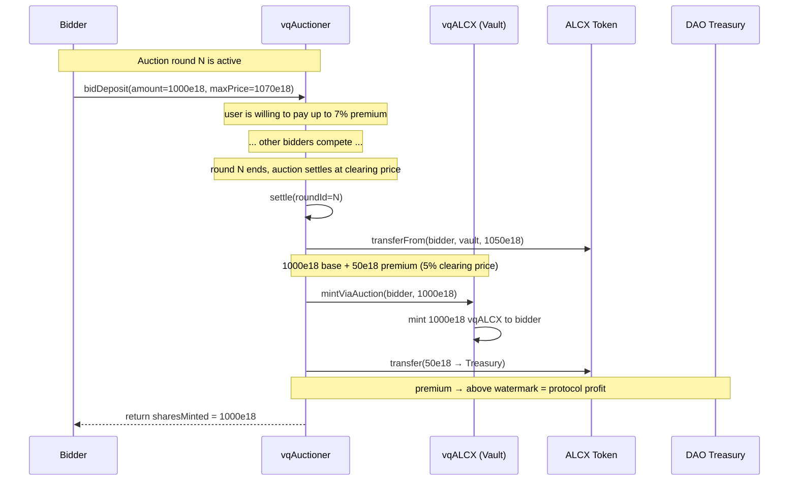
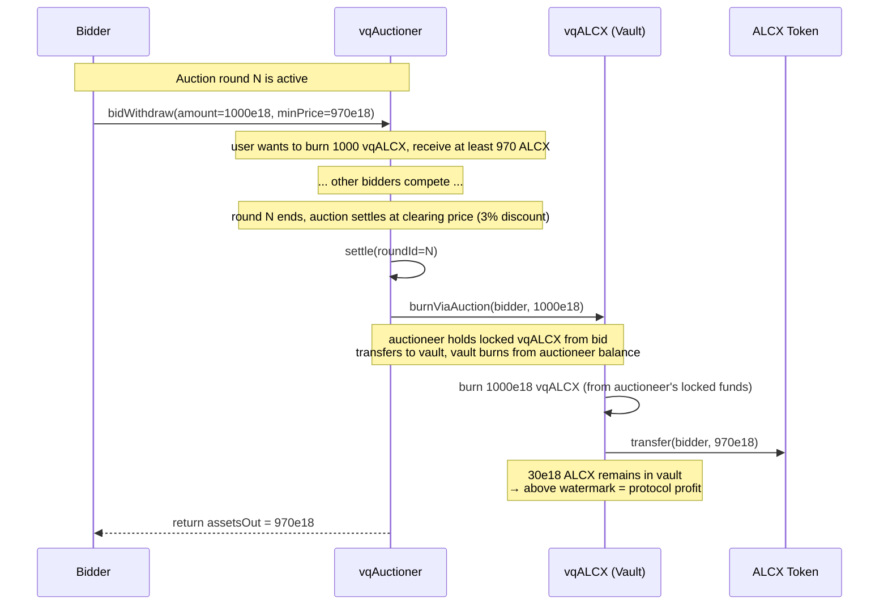

# VQALCX Architecture

The purpose of this document is to present the architectural decisions behind the VQALCX codebase
in an arc42-compliant way both in a descriptive way for future audits and developer onboarding and
predictive, meaning to document architectural constraints for future tech decisions.

# 1. Introduction and Goals

## 1.1 Short Description

veQueue is a rate-limited treasury vault protocol that transforms ALCX deposits into governance-secure share tokens (vqALCX). It provides the anti-sybil and capital-commitment layer underneath Alchemix's on-chain governance.

The system has three layers:

1. **vqALCX (the vault)** — the method of restricting the governance set. DAO-framework-agnostic. Users deposit ALCX and receive vqALCX after passing through an asynchronous FIFO queue governed by a configurable rate and capacity. The protocol also auctions a fixed capacity of "instant fill" slots. The queue throttle ensures governance power cannot be flash-borrowed or instantly dumped.

2. **vqALCX Staking Contract** — the method of placing votes and distributing rewards. Users stake vqALCX here to participate in governance and earn rewards. This contract is a DAO adapter — it is intentionally DAO-specific because its purpose is to bridge the DAO-agnostic vault to the vendor-specific DAO framework.

3. **DAO Framework** (e.g. Aragon) — the method votes are processed and executed. Always vendor-specific. The staking contract exposes voting weight to the DAO via the OpenZeppelin `VotesExtended` interface.

## 1.2 Driving Forces

- **Governance security:** Alchemix governance decisions are executed on-chain via Aragon DAO. Without a commitment mechanism, ALCX holders can be flash-loaned into voting weight, governance-attacked, and exited in the same block. A rate-limited deposit/withdrawal queue with lazy drip fulfillment makes buying or dumping voting power time-bound and expensive.
- **Decentralized treasury management:** The DAO needs to deploy ALCX productively (yield, operations, protocol changes) while guaranteeing depositors a 1:1 principal watermark. Any surplus above the watermark accrues to the DAO.
- **User incentive alignment:** Depositors have no natural reason to lock ALCX in a rate-limited vault. The broader Alchemix protocol may allocate reward incentives (any ERC-20) to the staking contract, which distributes them proportionally to staked vqALCX. The vault itself does not define, source, or control rewards — reward distribution is the staking contract's responsibility.

## 1.3 Quality Goals

| # | Quality Goal | Rationale |
|---|-------------|-----------|
| 1 | **Governance attack resistance** — deposit and exit flows must be rate-limited by configurable bucket parameters such that voting power cannot be acquired or disposed of within a single block | This is the primary purpose of the protocol. Without it, the entire governance stack is vulnerable to flash-loan attacks, rushed and bank runs |
| 2 | **Principal guarantee** — every backed vqALCX share must always be redeemable for exactly 1 ALCX at the watermark | Users loose WITH the protocol if backing gets below 1:1 but not TO the protocol. Everyone shares losses equally. |
| 3 | **Pluggable auctioneer** — auction pricing logic must be replaceable without redeploying the core vault | Economic conditions change. The protocol must allow swapping the auctioneer via governance without disrupting user positions. |
| 4 | **Permissionless progression** — the queue must advance without relying on any specific operator or keeper | Any state-changing vault interaction (requests, claims, auction hooks, parameter changes) triggers lazy bucket drip, processing the queue as a side effect; the public `drip()` lets anyone advance both queues. Views are pure reads and do not drip. No dedicated keeper role required. Walkaway safety. |

## 1.4 Stakeholders

| Stakeholder | Expectations |
|------------|-------------|
| **Alchemix DAO / governance** | Secure, sybil-resistant voting weight distribution; auction revenue stream; full parameter control via DAO proposals |
| **ALCX depositors / vqALCX holders** | 1:1 principal protection (watermark guarantee); fair queue ordering (FIFO, no front-running); underwater vault affects everyone equally |
| **vqALCX stakers** | Governance participation (vote via staking contract); reward distribution proportional to staked balance; DAO-framework-specific voting experience |
| **Auction participants** | Users who want immediate execution without waiting for the queue | Conventional rolling auctions determine market price; transparent pricing |
| **Operators / protocol engineers** | Pluggable auctioneer contract; DAO-specific staking contract (adapter); hardcoded safety bounds on bucket parameters; two-step ownership transfer for safe operator rotation |

# 2. Constraints

Constraints are hard facts that limit the design and implementation space. They cannot be changed by the team and must be accepted as given. They apply across the entire protocol and often originate from external systems, organizational structure, or regulatory requirements.

## 2.1 Technical Constraints

| # | Constraint | Origin | Impact |
|---|-----------|--------|--------|
| TC-1 | **ERC-20 / ERC-4626 token standards** — vqALCX shares conform to ERC-4626 (backed by ERC-20 ALCX). The vault token contract is DAO-agnostic and contains no DAO-framework-specific logic. | Industry standard | Constrains the share token interface. |
| TC-2 | **Three-layer DAO separation** — the protocol separates concerns into three layers: (1) the vault (vqALCX) restricts the governance set and is DAO-framework-agnostic; (2) the staking contract is the DAO adapter — it is intentionally DAO-specific and bridges the vault to the DAO framework; (3) the DAO framework (Aragon) processes and executes votes. Swapping DAO frameworks requires replacing the staking contract, not the vault. | Architectural decision | The vault must never import or reference DAO-framework-specific types. The staking contract MAY import DAO-specific types — that is its purpose. The vault exposes a `governanceAddress` for parameter changes. |
| TC-3 | **Timestamp-based clock mode** — all time-dependent operations (lazy drip, bucket rate, auction round durations, queue progression, staking rewards) must use `block.timestamp`, never `block.number`. This is an Aragon DAO requirement — Aragon's governance contracts use timestamp-based checkpoints for voting periods and delays. Block-number-based timing would create inconsistencies between the vault's internal clock and the DAO's voting snapshot clock. | Aragon DAO integration | All time comparisons, rate calculations, and drip logic must reference `block.timestamp`. No block-number-based time windows anywhere in the codebase. |
| TC-4 | **vqALCX must not be a rebalancing token** — for `getPastBalanceOf` and delegate overriding (ERC-5805 / Compound-style voting) to work properly, voting power and balance must always map 1:1. If vqALCX balances changed over time without explicit transfers (e.g. rebasing, yield accrual, auto-compounding), historical balance lookups would diverge from historical voting power, breaking governance snapshots. vqALCX is a standard ERC-4626 share token with a fixed conversion rate of 1:1 at the watermark — it does not rebase, accrue yield, or auto-compound into balances. | Governance / voting correctness | The vault must never mutate `balanceOf(user)` except through explicit `mint`, `burn`, and `transfer` operations. No `rebasing`, no `sync`, no silent balance updates. ERC-4626 share price must not float — it is pegged 1:1 at the watermark. |
| TC-5 | **OpenZeppelin VotesExtended interface** — the staking contract must implement OZ `VotesExtended`, which extends `Votes` (ERC-5805) with checkpointing for both delegations and balances. This provides `getPastBalanceOf(account, timepoint)` and `getPastDelegate(account, timepoint)` — historical lookups required by Aragon DAO for vote snapshot verification and delegate override functionality. The staking contract tracks staked balances internally (no receipt token) and exposes them as voting power to the DAO via this interface. | Aragon DAO integration / GovernorCountingOverridable | The staking contract inherits `VotesExtended`. `_getVotingUnits(account)` returns the internal staked balance. `_transferVotingUnits(from, to, amount)` must be called AFTER every stake and unstake so checkpoints reflect post-operation state. |

## 2.2 Organizational Constraints

| # | Constraint | Origin | Impact |
|---|-----------|--------|--------|
| OC-1 | **Walkaway safety** — the protocol must be fully permissionless and self-sustaining. If Alchemix as a company were to shut down, the protocol must continue to operate correctly: queues must progress, withdrawals must be fulfillable, and the vault must remain solvent. No role in the system may be single-point-of-failure that depends on an individual or organization being available. | Decentralization requirement | No centralized keeper, operator, or admin key may be required for normal operation. All critical flows (queue processing, withdrawals) advance automatically via lazy drip. Emergency roles (pause, parameter changes) must be survivable if permanently unused. |
| OC-2 | **Multi-sig operator model** — Alchemix team drives protocol contracts through Gnosis Safes. Ownership, parameter changes, and emergency actions require multi-sig confirmation. This adds latency to operational responses but prevents single-key compromise. | Alchemix operational security | Emergency actions (pausing, parameter changes) are subject to multi-sig confirmation delays. The protocol must be resilient enough to survive during this delay window. |
| OC-3 | **Governance-driven parameter changes** — protocol parameters (flow rates, premiums) are ultimately controlled by DAO vote. The engineering team proposes and implements, but does not unilaterally decide parameter values. | Decentralized governance | The protocol must expose clear governance interfaces with sensible defaults and hardcoded safety bounds to prevent governance from setting destructive parameters. |

## 2.3 Conventional and Regulatory Constraints

| # | Constraint | Origin | Impact |
|---|-----------|--------|--------|
| CC-1 | **ALCX tokenomics** — ALCX is the single governance token of the Alchemix ecosystem. It has an emission-based supply schedule. The protocol's auction mechanics and any reward allocations must operate within the constraints of available ALCX supply. | Token design | Long-term sustainability of reward allocations depends on DAO treasury decisions, not protocol design alone. The protocol must not assume any emission/mint budget. |
| CC-2 | **MEV exposure** — all on-chain transactions are visible in the mempool before inclusion. Queue operations and auction bids are subject to MEV extraction (front-running, sandwich attacks, priority gas auctions). | Ethereum network architecture | Queue ordering must be deterministic and resistant to front-running (FIFO ordering). Rolling auction design must account for MEV bots monitoring transactions. |


# 3. Context and Scope

This section delimits the veQueue protocol from its external communication partners — neighboring systems, on-chain protocols, and human actors. It defines what is inside the system boundary and what lies outside, along with the interfaces between them.

## 3.1 System Boundary

The veQueue protocol encompasses:
- The main ERC4626 vault contract (deposit/withdrawal queue, share minting/burning, watermark accounting) — DAO-agnostic
- The FIFO queue logic and lazy drip engine
- The rolling auction mechanism (auctions "instant fill" capacity for max protocol revenue)
- The vqALCX staking contract (DAO adapter — places votes, distributes rewards, implements VotesExtended)
- Safety latches and access control

The veQueue protocol does **not** encompass:
- The DAO governance framework itself (currently Aragon) — how proposals are created, voted on, and executed is vendor-specific. The staking contract bridges to it but does not contain it.
- Gnosis Safes — these are an external operational tool
- Any off-chain infrastructure (frontends, indexers, RPC nodes)

## 3.2 External Communication Partners

### 3.2.1 Neighboring On-Chain Systems

| System | Direction | Interface | Description |
|--------|-----------|-----------|-------------|
| **DAO Governance** (e.g. Aragon) | Bidirectional | Staking contract (`VotesExtended`) | The DAO reads voting weight from the staking contract via `getPastVotes`, `getPastBalanceOf`, `getPastDelegate`. The DAO executes parameter changes on the vault via `governanceAddress`. The staking contract is the DAO adapter. |
| **ALCX Token** | Bidirectional | ERC-20 | Users deposit ALCX into the vault. The vault holds ALCX as the base asset. ALCX is the unit of account for the watermark, share minting, and withdrawal calculations. |
| **Gnosis Safes** | Unidirectional (inbound) | Owner/admin role on protocol contracts | Gnosis Safes hold the operational keys for the protocol. They are used for initial configuration, emergency actions, and two-step ownership transfers. They are not required for normal protocol operation (walkaway safety). |

### 3.2.2 External Actors

| Actor | Role | Interaction Pattern |
|-------|------|-------------------|
| **Depositors / vqALCX holders** | Primary users who deposit ALCX to receive governance-secure vqALCX shares | Call `requestDeposit()` to enter the deposit queue. Queue advances lazily on state-changing vault interactions. Call `deposit()` when position is fulfillable. Can transfer vqALCX freely. Call `requestWithdraw()` to enter the exit queue. Call `withdraw()` when position is fulfillable. Can stake vqALCX in the staking contract to earn rewards and participate in governance. |
| **Auction participants** | Users who want immediate execution without waiting for the queue | Bid in rolling auctions for deposit or withdraw execution. Auctions run continuously. Can bid on full or fractional amounts. No queue position required — auctions and queue are orthogonal paths. |
| **DAO voters** | Token holders who participate in governance votes | Vote on Aragon (or equivalent) proposals. Their voting weight is derived from **staked** vqALCX in the staking contract at snapshot time. veQueue does not define the voting mechanism — the staking contract bridges to the DAO. |
| **MEV bots** | General blockchain participants, not a protocol role | MEV bots are an ever-present force on Ethereum. Their presence must be accounted for in queue ordering (FIFO prevents front-running) and rolling auction design. They have no special interface with the protocol and no privileged access. |

## 3.3 Context Diagram



# 4. Solution strategy

## 4.1 ERC4626 vault with lazy queue fulfillment

vqALCX is an ERC4626-compliant vault. Users choose between two orthogonal paths:

1. **Queue path:** `requestDeposit()` or `requestWithdraw()` enters the caller into the respective FIFO queue. Queue positions are fulfilled lazily over time by the leaky bucket drip. 1:1 backing, no premium.
2. **Auction path:** bid in rolling auctions for immediate execution. No queue entry. The protocol auctions a fixed capacity of "instant fill" slots for maximum revenue — market demand determines the price.

**These paths are independent.** A user is never forced to commit to the queue with no way out. She can choose queue, auction, or both. If her auction bid fails, she is not stuck in the queue — she simply didn't get an instant fill and can try again or fall back to the queue.

**Queue entries are tracked internally:**

- Each `requestDeposit()` records the user's deposit amount in the queue
- Each `requestWithdraw()` records the user's withdrawal amount in the queue
- Queue entries are not tokenized — they are internal accounting entries
- On fulfillment, the user calls `deposit()` or `withdraw()` to claim their fulfilled position

**Queue cancellation with penalties:**

Users can cancel a pending queue request via `cancelDepositRequest()` or `cancelWithdrawRequest()`. Cancellation removes the entry from the queue and refunds the user, minus a penalty:

- **Deposit cancellation:** the user's request is voided. ALCX was escrowed into the vault at `requestDeposit()` time; the unfilled remainder is refunded minus a penalty. The filled portion (if any) stays claimable as shares. A cancellation fee in ALCX is charged to prevent queue spam (requesting then canceling repeatedly to hold capacity).
- **Withdrawal cancellation:** the user's withdraw request is voided. If vqALCX was locked at `requestWithdraw()` time, it is returned minus a penalty. The penalty discourages withdraw spam that could artificially inflate the withdraw queue depth.
- **Penalty destination:** penalties go above the watermark as protocol profit.
- **Penalty amount:** governance-configurable, with hardcoded safety bounds to prevent punitive levels.

**Pause semantics (emergency brake matrix):**

When governance pauses the vault:

- **Blocked:** new `requestDeposit` and `requestWithdraw` (entry and exit queueing), and `mintViaAuction` (instant-entry auction mints).
- **Open:** claims of already-escrowed positions (`deposit`/`mint` for filled deposit requests, `withdraw`/`redeem` for filled withdraw requests), vqALCX transfers, and `burnViaAuction` (instant-exit auction burns).
- Exit liveness under pause is therefore claim-only: users with already-fulfilled requests can always exit; users cannot queue *new* exits during an incident.

**Lazy drip model (timestamp-based)** The queue advances automatically as a side effect of state-changing vault calls (requests, claims, cancels, auction hooks, parameter changes, and the permissionless `drip()`). Views are pure reads — they report the state persisted by the last transaction and never advance the queue. Each elapsed window's budget is granted exactly once into a persisted `availableBudget` accumulator (`availableBudget += rate * (now - lastDripTime)`; `lastDripTime` always advances). A drip call touches at most `MAX_DRIP_ENTRIES` entries; if the queue is longer, the unspent budget carries in `availableBudget` and continues on the next call (bounded gas, unbounded progress over multiple calls, and a window's budget can never be re-granted — INV-Q-3):

```
fulfillable = min(availableBudget, queueDepth)
// leftover when the queue is fully caught up -> availableAuctionCapacity
```

The bucket processes FIFO entries from the front until `fulfillable` is exhausted. No separate advance/fulfill transaction needed. **All timing uses `block.timestamp`, never `block.number`** (TC-3 — Aragon requirement for consistent governance clock).

**Two-counter queue structure (O(1) per operation):**

```
uint256 head;     // index of next request to fulfill
uint256 tail;     // index where next new request is appended
mapping(uint256 => Request) requests;  // requestId → (owner, amount)
```

- `requestDeposit(amount)`: write `requests[tail]`, increment `tail` — O(1)
- Lazy drip: process from `head`, mark fulfilled, increment `head` — O(1) per fulfilled request
- Queue depth: `tail - head` — O(1)

ERC4626 preview functions (`previewDeposit`, `previewRedeem`, `previewWithdraw`, `previewMint`) are exact 1:1 conversions — they convert between assets and shares at the pegged rate. They are conversion quotes, not executability signals: whether a claim will succeed depends on queue state and is signalled by the `max*` functions, which quote the largest amount a single claim can execute for the claimant.

## 4.2 Auction mechanism — "instant fill" capacity auctions

The auction contract (`vqAuctioner`) runs continuous rolling auctions for both deposits and withdrawals. These auctions sell a fixed capacity of **instant fill** slots — the right to mint vqALCX immediately (deposit) or burn vqALCX for ALCX immediately (withdrawal), bypassing the queue entirely.

**Why auctions, not a fixed price?** The protocol has a fixed capacity of instant fills it can offer. The seller (the protocol) does not know demand beforehand. A fixed price would either leave money on the table (if demand is high) or get no bids (if price is too high). Rolling conventional auctions let the market discover the true price, maximizing protocol revenue.

**Queue and auction are orthogonal:**

- **Queue path:** user requests deposit/withdraw, waits for lazy drip fulfillment. 1:1 backing, no premium.
- **Auction path:** user bids for an instant fill slot. Market price, no waiting.
- A failed auction bid does not leave the user stuck anywhere — she simply didn't get an instant fill and can try again next round or fall back to the queue.

**Rolling auction model (English auction, v1):**

The auctioneer is pluggable. The v1 implementation uses a conventional **English ascending auction** with rolling rounds:

- **Each round has a fixed duration** (governance-configurable, e.g. 1 hour).
- **Bidding is competitive in both directions** — deposit auctions ascend on `maxPrice` (each new bid must strictly exceed the current highest). Withdrawal auctions descend on `minPrice` (each new bid must be strictly lower), with an equal-price escape hatch: at the same `minPrice`, a bid for strictly more capacity replaces the leader. This keeps floor-price (`minPrice = 0`) bids replaceable so a dust bid cannot monopolize a round. Bidders lock their ALCX (deposit auctions) or vqALCX (withdrawal auctions) into the auctioneer at bid time to prevent griefing.
- **Outbid funds are refunded** — when a higher bid arrives, the previous bidder's locked funds are returned.
- **Round settles at expiry** — the highest bidder wins. The clearing price is the winning bid amount. The winner pays base (1:1) + premium (above watermark).
- **Overlapping rounds** — when a round settles, the next round is already active. There is always a live auction.
- **Instant fill capacity** — each round's instant fill capacity is bounded by `rate * roundDuration` — the same leaky bucket budget that the queue draws from. The queue and auction compete for the same rate allocation: queue gets it for free (1:1), auction sells it to the highest bidder. This ensures the rate limit is never bypassed — total fills per round (queue + auction) cannot exceed the bucket budget.
- **Failed bids** — losing bidders get their locked funds refunded automatically at settlement. No funds are at risk for non-winners.

**Bid locking:** to prevent griefing (fake bids with no intent to pay), bidders must lock their assets in the auctioneer contract when placing a bid. For deposit auctions, the bidder locks ALCX. For withdrawal auctions, the bidder locks vqALCX. Locked funds are refundable to outbid users.

**Auction settlement and watermark:**

For deposit auctions, the winning bidder pays ALCX (base amount + premium). The premium goes above the watermark as protocol profit. For withdrawal auctions, the winning bidder receives ALCX at a discount — the discount stays in the vault above the watermark as protocol profit.

**Watermark profit model:**

```
Vault ALCX balance
        |
        |  <- auction premiums (above watermark = protocol profit)
  ======|======  WATERMARK = totalSupply(vqALCX) x 1 ALCX
        |  <- user deposits (1:1 backing)
```

Everything at or below the watermark is user principal, backed 1:1 by ALCX. Everything above the watermark (auction premiums) is Alchemix protocol profit. Rewards are handled by the staking contract, not the vault.

## 4.3 Pluggable components and access control

Auction contracts are replaceable by governance without modifying the core vault. The vault holds an `authorizedAuctioneer` address that can be swapped. The staking contract is also replaceable — swapping DAO frameworks requires deploying a new staking contract, not touching the vault.

**`governanceAddress` lifecycle:**
- **Initial deployment:** `governanceAddress` is set to a Gnosis Safe (OC-2) for initial configuration and emergency actions.
- **Transfer to DAO:** once the DAO governance (Aragon) is operational, a two-step ownership transfer (`proposeGovernance` → `acceptGovernance`) moves `governanceAddress` to the DAO's execution address (e.g. Aragon's agent).
- **After transfer:** the Gnosis Safe retains only emergency pause capability (if configured). All parameter changes flow through DAO proposals. The vault is unaware of how the DAO makes decisions — it only checks `msg.sender == governanceAddress`.

## 4.4 vqALCX staking contract (DAO adapter)

The staking contract bridges the DAO-agnostic vault to the vendor-specific DAO framework. It is intentionally DAO-specific — that is its purpose.

**Responsibilities:**
- **Staking:** users deposit vqALCX into the staking contract to participate in governance. The staking contract tracks each user's staked balance in an internal mapping. No receipt token is issued — balances are tracked internally.
- **Voting power:** the staking contract implements OpenZeppelin `VotesExtended` (TC-5). The DAO reads voting weight via `getPastVotes`, `getPastBalanceOf`, `getPastDelegate`. `_getVotingUnits(account)` returns the internal staked balance. Delegation operates on staked balances.
- **Reward distribution:** external reward sources transfer assets to the staking contract, which distributes them proportionally to *seasoned* stakers — balances that have been staked longer than `REWARD_WARMUP` (1 day). Newly staked balances earn nothing during the warm-up (a just-in-time stake cannot capture a donation), while voting power is live immediately. The vault itself does not handle rewards.
- **Unstaking:** users call `unstake(amount)` to withdraw their vqALCX from the staking contract. Instant — no lockup or queue.

**Why a separate contract?**
- The vault must remain DAO-framework-agnostic (TC-2). All DAO-specific logic — Aragon proposal formatting, vote casting, delegate override — lives in the staking contract.
- Not all vqALCX holders need to participate in governance. Only staked vqALCX counts for voting.
- Swapping DAO frameworks (Aragon → OZ Governor) requires replacing the staking contract only. The vault is untouched.

**Interface sketch:**

```solidity
// Staking — internal balance tracking, no receipt token
stake(amount: uint256)       // pull vqALCX, credit stakedBalance[user]
unstake(amount: uint256)     // reduce stakedBalance[user], return vqALCX
claimRewards()
stakedBalanceOf(account: address) -> uint256   // view

// VotesExtended (inherited from OZ) — read by DAO, operates on staked balances
getVotes(account: address) -> uint256
getPastVotes(account: address, timepoint: uint256) -> uint256
getPastBalanceOf(account: address, timepoint: uint256) -> uint256
getPastDelegate(account: address, timepoint: uint256) -> address
delegate(delegatee: address)
clock() -> uint48          // returns block.timestamp (TC-3)
CLOCK_MODE() -> string     // "mode=timestamp" (ERC-6372 canonical)
```

## 4.5 vqAuctioner function signatures

```solidity
// Auction views
currentAuctionRound() → uint256
auctionState(roundId: uint256) → AuctionState    // Active, Settled, Cancelled
auctionPrice(roundId: uint256) → uint256         // clearing price for settled round

// Bid in deposit auction — user pays ALCX, receives vqALCX on settlement
bidDeposit(amount: uint256, maxPrice: uint256) → uint256 bidId

// Bid in withdraw auction — user burns vqALCX, receives ALCX on settlement
bidWithdraw(amount: uint256, minPrice: uint256) → uint256 bidId

// Settle a completed auction round
settle(roundId: uint256)
```

## 4.6 Vault interface for auctioneer

```solidity
// Queue state views — auctioneer reads these
depositQueueDepth() → uint256
depositBucketCapacity() → uint256
depositBucketRate() → uint256
withdrawQueueDepth() → uint256
withdrawBucketCapacity() → uint256
withdrawBucketRate() → uint256

// Privileged functions — authorized auctioneer only
// Called on auction settlement to execute the auction result
// Auctioneer must have transferred/locked the necessary tokens beforehand
mintViaAuction(to: address, amount: uint256)     // mints vqALCX to auction winner
burnViaAuction(from: address, amount: uint256)   // burns vqALCX from auctioneer's locked balance, sends ALCX to winner
```
# 5. Building block view



# 6. Runtime view

## 6.1 Normal deposit → withdraw lifecycle



## 6.2 Staking — governance participation and rewards



## 6.3 Deposit auction (immediate execution)



## 6.4 Withdrawal auction (immediate execution)



# 7. Deployment view

```
+-----------------------------------------------------------+
|                   veQueue Protocol                         |
|                                                           |
|  +--------------+  +--------------+  +---------------+    |
|  |  vqALCX      |  | vqAuctioner  |  | vqStaking     |    |
|  |  (Vault)     |  | (Auction)    |  | (DAO Adapter) |    |
|  |  ERC-4626    |  |              |  |               |    |
|  |              |  |              |  |  Internal     |    |
|  |  Queue       |  |  English     |  |  balances     |    |
|  |  Engine      |  |  Auction     |  |  Stake/unstake|    |
|  |  Lazy Drip   |  |  Rounds      |  |               |    |
|  |              |  |              |  |  VotesExtended|    |
|  +------+-------+  +------+-------+  +-------+-------+    |
|         |                 |                  |            |
|         |  authorized     |  mint/burn       |  holds     |
|         |  auctioneer     |  via vault       |  vqALCX    |
|         +-----------------+                  |            |
|         | governanceAddress                  |            |
|                                            |            |
+---------|-----------------------------------|------------+
          |                                   |
          v                                   v
   +-------------+                   +-----------------+
   | ALCX Token  |                   | DAO Governance  |
   | (ERC-20)    |                   | (e.g. Aragon)   |
   +-------------+                   |                 |
                                     | readsVotesExt   |
                                     | from vqStaking  |
                                     +-----------------+
```

**Deployed contracts:**

| Contract | Standard | Role |
|----------|----------|------|
| **vqALCX** | ERC-4626 / ERC-20 | Vault + share token. Queue engine, lazy drip, watermark. DAO-agnostic. |
| **vqAuctioner** | — | Rolling English auction for instant fills. Pluggable. Stateful. |
| **vqStaking** | VotesExtended | DAO adapter. Tracks staked balances internally. Distributes rewards. Aragon-specific. |


# 8. Crosscutting concepts

## 8.1 ERC4626 compliance (vault — DAO-agnostic)

The vqALCX vault implements the full ERC4626 interface. Preview functions are exact 1:1 conversions at the pegged rate (never optimistic about share pricing). Executability of a claim is a queue property and is signalled by the `max*` functions, which quote the claimant's largest single-request claimable so that `deposit(maxDeposit())` always succeeds. This ensures composability with DeFi infrastructure (wallets, DEXes, lending protocols) that rely on standard vault interfaces. The vault contains zero DAO-framework-specific logic.

**Non-rebalancing (TC-4):** vqALCX is NOT a rebasing or yield-accruing token. `balanceOf(user)` only changes through explicit `mint`, `burn`, and `transfer`. The ERC-4626 share price is pegged 1:1 at the watermark — it does not float upward over time. This is critical because the staking contract uses vqALCX balances as the basis for voting power (TC-5). If balances silently changed (rebasing, auto-compounding), historical lookups would diverge from historical voting power, breaking Aragon snapshot logic.

## 8.2 VotesExtended and reward distribution (staking contract — DAO adapter)

**VotesExtended (TC-5):** the staking contract inherits OpenZeppelin `VotesExtended`, which extends `Votes` (ERC-5805) with checkpointing for both staked balances and delegates. This provides `getPastBalanceOf(account, timepoint)` and `getPastDelegate(account, timepoint)` — historical lookups that Aragon DAO requires for vote snapshot verification and delegate override (`GovernorCountingOverridable`). `_getVotingUnits(account)` returns the internal staked balance. Every stake and unstake must call `_transferVotingUnits` AFTER the balance update.

**Reward distribution:** external reward sources transfer assets to the staking contract (not the vault). The staking contract distributes them proportionally to stakers. The vault itself does not handle rewards — this is entirely the staking contract's responsibility.

## 8.3 Watermark accounting

The vault maintains a strict separation between user principal and protocol profit:

- **Watermark** = `totalSupply(vqALCX) * 1 ALCX` — this is the guaranteed minimum backing.
- **User deposits** contribute at the watermark level (1:1 backing).
- **Auction premiums** (both deposit and withdrawal) contribute above the watermark (protocol profit).
- **External reward transfers** go to the staking contract (not the vault) and are distributed to stakers.
- Users can always redeem at the watermark. Protocol profit above the watermark is owned by the DAO and can be harvested or reinvested via governance.

## 8.4 Leaky bucket queue with lazy drip

Each queue (deposit and withdraw) is an independent leaky bucket:

- **`capacity`** — maximum total amount that can be pending at once.
- **`rate`** — amount fulfilled per second (the drip rate).
- **`lastDripTime`** — timestamp of the last completed catchup. On state-changing vault interactions, the bucket catches up by granting `rate * (now - lastDripTime)` into `availableBudget` exactly once. A drip call touches at most `MAX_DRIP_ENTRIES` entries; if the queue is longer, the unspent budget carries over in `availableBudget` to the next call.
- **`availableBudget`** — fulfillment budget granted but not yet spent on fills; the unspent remainder when a drip call is capped. Rebased proportionally with `availableAuctionCapacity` on rate changes.
- **Two-counter structure** — `head` and `tail` indices provide O(1) enqueue, O(1) dequeue, and O(1) position lookup.
- **`queueDepth`** — total amount pending in the queue (`tail - head`).
- Parameters are set by governance.

No external keeper or epoch boundary is needed. The queue is always current after any state-changing interaction — every transaction that touches the vault drips as a side effect, and `drip()` is permissionless. Views are pure reads and report the last persisted state (EVM views cannot mutate storage).

## 8.5 Rolling auction mechanism (English, v1)

The auctioneer is pluggable (governance can swap the implementation). The v1 uses a conventional English ascending auction:

- **Ascending bids (deposit) / descending bids (withdrawal)** — deposit bids must strictly exceed the current `maxPrice`; withdrawal bids must be strictly below the current `minPrice`, or equal to it with a strictly larger amount. Outbid funds are refunded immediately.
- **Bid locking** — bidders lock ALCX (deposit) or vqALCX (withdrawal) in the auctioneer at bid time. Prevents griefing.
- **Rolling rounds** — auction rounds overlap. When one settles, the next is already active.
- **Capacity per round** — bounded by `rate * roundDuration`, drawn from the same leaky bucket as the queue. Queue and auction share the rate budget — queue gets it free, auction allocates to highest bidders. The rate limit is never bypassed.
- **Settlement** — at round expiry, highest bidders win up to capacity. Clearing price = winning bid. Losers get locked funds refunded.
- **Future formats** — the pluggable design allows upgrading to Dutch, sealed-bid, or uniform-price without touching the vault.

## 8.6 Queue entries

Each queue entry is an internal accounting record, not a token:

- **Deposit entries** — created on `requestDeposit()`, fulfilled by lazy drip. User calls `deposit()` when their position is fulfillable to receive vqALCX.
- **Withdraw entries** — created on `requestWithdraw()`, fulfilled by lazy drip. User calls `withdraw()` when their position is fulfillable to receive ALCX.
- **Not tokenized** — queue entries are internal to the vault. No separate claim token contract.
- **FIFO fairness** — entries are fulfilled strictly in order of submission.
- **Queue and auction are orthogonal** — holding a queue position does not prevent the user from bidding in auctions.

# 9. Architectural decisions

## 9.1 FIFO leaky bucket with lazy drip

- **Decision:** use leaky bucket queues with continuous drip rate and lazy evaluation for both deposit and withdraw flows.
- **Rationale:** provides deterministic, rate-limited access to governance power. Continuous drip (rate per second) avoids discrete epoch boundaries. Lazy evaluation means any vault interaction advances the queue — no keeper role needed, satisfying walkaway safety. Two-counter (head/tail) structure ensures O(1) per operation.
- **Trade-off:** if nobody interacts with the vault for a long period, no queue processing happens. In practice, MEV bots and user interactions provide sufficient activity. The guarantee is no worse than a keeper-dependent model.

## 9.2 ERC4626 standard interface

- **Decision:** implement the vault as a fully compliant ERC4626.
- **Rationale:** standard interface ensures composability with the broader DeFi ecosystem. Preview functions provide honest queue-state reflection.
- **Trade-off:** the async queue model doesn't perfectly fit ERC4626's synchronous expectation (deposit != instant mint), requiring the `requestDeposit` -> `deposit` two-step flow.

## 9.3 Timestamp-based clock mode (not block-based)

- **Decision:** all time-dependent operations use `block.timestamp`, never `block.number`.
- **Rationale:** Aragon DAO uses timestamp-based checkpoints for voting periods, delays, and snapshots. If the vault used block-number-based timing for queue drip or auction rounds, the vault's internal clock would diverge from the DAO's governance clock, causing inconsistencies in voting power lookups and proposal timing. Timestamp-based timing is also more intuitive for users (seconds, not blocks) and aligns with Ethereum's post-merge predictable ~12s block time.
- **Trade-off:** `block.timestamp` can be manipulated by validators within a small window (~15 seconds). This is acceptable for queue drip (a few seconds of drift has no economic impact) and auction round boundaries (rounds are long enough that timestamp manipulation is not profitable).

## 9.4 Non-rebalancing token design

- **Decision:** vqALCX balances only change through explicit `mint`, `burn`, and `transfer`. No rebasing, no auto-compounding, no silent balance updates.
- **Rationale:** for `getPastBalanceOf` and delegate overriding to work properly, voting power and balance must always map 1:1. If balances changed without explicit transfers (e.g. yield accrual changing share price), historical balance checkpoints would not match historical voting power — Aragon's snapshot logic would break. The watermark is a hard floor at 1:1; it does not float upward. Protocol profit accrues above the watermark (as vault ALCX surplus), not by inflating user balances.
- **Trade-off:** vqALCX holders do not see their balance grow over time from yield. Yield and rewards are external transfers or separate distribution mechanisms. This is a deliberate sacrifice of "auto-compounding UX" for governance correctness.

## 9.5 Three-layer DAO separation

- **Decision:** separate the system into three layers: (1) the vault (DAO-agnostic), (2) the staking contract (DAO adapter), (3) the DAO framework (vendor-specific).
- **Rationale:** the vault's sole job is restricting the governance set via rate-limited entry/exit. It must not depend on any specific DAO framework. The staking contract's job is bridging the vault to the DAO — it IS intentionally DAO-specific. This separation means swapping DAO frameworks (Aragon → OZ Governor) requires replacing only the staking contract. The vault, queue, and auction are untouched.
- **Trade-off:** users must stake vqALCX into a separate contract to participate in governance — raw vqALCX balance alone does not give voting power. This adds a step for governance participants but cleanly isolates DAO-specific concerns.

## 9.6 OpenZeppelin VotesExtended on the staking contract

- **Decision:** the staking contract (not the vault) inherits OpenZeppelin `VotesExtended` (which extends `Votes` / ERC-5805).
- **Rationale:** the standard `Votes` interface only checkpoints voting power (`getPastVotes`), not raw balances or delegates. Aragon DAO's `GovernorCountingOverridable` requires `getPastBalanceOf(account, timepoint)` and `getPastDelegate(account, timepoint)` to verify delegate overrides during live votes. `VotesExtended` adds these checkpoint arrays. Placing it on the staking contract (not the vault) keeps the vault DAO-agnostic — the vault doesn't need VotesExtended, checkpoint logic, or delegation mechanics.
- **Integration requirements:**
  - `_getVotingUnits(account)` returns the internal staked balance — ties directly to TC-4 (non-rebalancing)
  - `_transferVotingUnits(from, to, amount)` called AFTER every stake and unstake
  - `clock()` returns `block.timestamp`, `CLOCK_MODE()` returns timestamp mode — ties to TC-3
- **Trade-off:** `VotesExtended` adds gas cost to staking/unstaking operations (two extra checkpoint writes: one for balance, one for delegate). This is acceptable given governance correctness requirements.

## 9.7 Pluggable auctioneer

- **Decision:** auction logic lives in a separate, replaceable contract authorized by the vault.
- **Rationale:** allows upgrading auction mechanics (round format, settlement logic, bidding rules) without touching the vault. The vault only needs `mintViaAuction` and `burnViaAuction` — it doesn't know or care about the auction format.
- **Trade-off:** the auctioneer must be trusted with mint/burn authority. Governance can revoke and replace via `authorizedAuctioneer` setter. The auctioneer is stateful (must track rounds and bids), which increases complexity compared to a stateless design.

## 9.8 English auction for v1 (pluggable for future formats)

- **Decision:** use a conventional English ascending auction for v1. The auction format is pluggable — future versions can use Dutch, sealed-bid, or uniform-price without touching the vault.
- **Rationale:** the seller does not know demand beforehand. A deterministic price curve cannot respond to real market conditions — it would either overprice (no bids) or underprice (leaving money on the table). English auctions are the simplest format that provides genuine price discovery: ascending bids, highest bidder wins, outbid funds refunded. Auctions and queue are orthogonal paths, so users are never forced to accept a bad auction price — they can always fall back to waiting in the queue.
- **Trade-off:** English auctions require bid locking (to prevent griefing) and settlement latency (must wait for round end). The auctioneer is stateful. However, the market-driven pricing is more economically sound than a deterministic formula. Future formats can be deployed by swapping the auctioneer contract. Instant fill capacity draws from the same bucket rate as the queue — this ensures the governance attack resistance guarantee (quality goal #1) is never bypassed. The queue effectively subsidizes patient users at 1:1, while the auction captures maximum revenue from impatient users.

## 9.9 No staking receipt token

- **Decision:** the staking contract tracks staked balances internally via a mapping. No receipt token is issued.
- **Rationale:** VotesExtended only needs `_getVotingUnits(account)` to return a value — it does not require an ERC-20 token. The staking contract maintains `mapping(address => uint256) stakedBalance` and returns that from the hook. Since unstaking is instant (no lockup or queue), users who want to exit just unstake and transfer vqALCX directly. A receipt token would only add value if there were an unbonding period, which there isn't.
- **Trade-off:** staked positions are not transferable on secondary markets without unstaking first. This is acceptable because unstaking is a single instant transaction. Removing the receipt token eliminates one token, one set of invariants, and ERC-20 mint/burn gas overhead per stake/unstake.

## 9.10 Queue cancellation with penalties

- **Decision:** users can cancel pending queue requests. Cancellation charges a governance-configurable penalty that accrues above the watermark as protocol profit.
- **Rationale:** without cancellation, users who change their mind are locked until drip fulfills them. This is poor UX and could deter deposits. The penalty prevents queue spam (requesting then canceling to hold capacity without commitment).
- **Trade-off:** cancellation adds complexity (void logic in the queue, penalty accounting). The penalty must be high enough to deter spam but low enough to not trap users. Governance can tune this.

## 9.11 Internal queue entries (no claim token)

- **Decision:** queue positions are internal accounting entries, not a separate token. No ERC-6909, no ERC-721, no claim token contract.
- **Rationale:** the only reason to tokenize queue positions would be to make them tradeable ("sell your spot in line"). But with orthogonal queue and auction paths, there is no secondary market need for queue positions. The queue is for patient users who want 1:1 execution. The auction is for impatient users who want immediate execution at market price. Removing the claim token simplifies the system — one fewer contract, one fewer invariant set, one fewer token to secure.
- **Trade-off:** queue positions are not transferable. A user who entered the queue cannot sell her position to someone else. She can cancel with a penalty or wait for fulfillment. Cancellation ensures no one is permanently trapped in the queue.

# 10. System invariants

These invariants define properties that must hold true across all states of the system. They are expressed in natural language and map directly to Foundry invariant test assertions.

## 10.1 Watermark and solvency invariants

| ID | Invariant | Notes |
|----|-----------|-------|
| INV-WM-1 | The vault's ALCX balance is always >= totalSupply(vqALCX) | The watermark guarantee. Every share is backed by at least 1 ALCX. This must hold after every operation. |
| INV-WM-2 | `previewRedeem(shares) <= shares x 1` | Users can never redeem more than 1:1 at the watermark. No inflation of share value beyond the backing. |
| INV-WM-3 | Minting vqALCX always increases the vault's ALCX balance by at least the equivalent share amount | Every new share is fully backed at the moment of minting. |
| INV-WM-4 | Burning vqALCX never releases more ALCX than the shares being burned | The vault never overpays on withdrawal. |
| INV-WM-5 | Protocol profit (vault balance - watermark) is always >= 0 | The watermark is a hard floor, not a target. The vault never runs a deficit. |

## 10.2 Queue and bucket invariants

| ID | Invariant | Notes |
|----|-----------|-------|
| INV-Q-1 | depositQueueDepth <= depositBucketCapacity | The deposit queue can never exceed its bucket capacity. |
| INV-Q-2 | withdrawQueueDepth <= withdrawBucketCapacity | The withdraw queue can never exceed its bucket capacity. |
| INV-Q-3 | Lazy drip processes at most `rate * (now - lastDripTime)` worth of requests per catchup | The drip rate per second is the upper bound on processing speed. |
| INV-Q-4 | Queue ordering is FIFO — no position is fulfilled before an earlier position in the same queue | Guarantees fairness. |
| INV-Q-5 | A user's fulfilled amount never exceeds their requested amount | Users get exactly what they asked for, never more. |
| INV-Q-6 | `previewDeposit` and `previewRedeem` are exact 1:1 conversions, and `deposit(maxDeposit(caller))` succeeds whenever `maxDeposit > 0` | Previews never misprice the 1:1 peg (no slippage); executability is signalled by `max*`, which quotes the largest single-request claimable for the claimant. |
| INV-Q-7 | head <= tail always — head never exceeds tail | No underflow in queue indices. |
| INV-Q-8 | Total queued deposit amount equals sum of all pending deposit requests | Internal accounting is consistent. |
| INV-Q-9 | Queue cancellation removes the entry and charges the configured penalty — no free exits | Prevents queue spam. Penalties accrue above the watermark as protocol profit. |
| INV-Q-10 | A cancelled entry does not affect the FIFO ordering of other entries | Cancellation voids the slot; other entries' relative positions are unchanged. |

## 10.3 Auction invariants

| ID | Invariant | Notes |
|----|-----------|-------|
| INV-A-1 | Every settled auction round results in vqALCX being minted (deposit) or burned (withdrawal) in correct amounts | The auctioneer cannot create or destroy shares arbitrarily. |
| INV-A-2 | Auction premiums always accrue above the watermark as protocol profit | For deposit auctions: base amount backs shares, premium goes to treasury. For withdrawal auctions: discount stays in vault. |
| INV-A-3 | The auctioneer's ALCX balance is always 0 after settlement completes | The auctioneer is a passthrough. No ALCX accumulates in the auctioneer. |
| INV-A-4 | `maxPrice` / `minPrice` parameters in bids are enforced — no bid executes beyond the user's stated tolerance | Users have slippage protection. |
| INV-A-5 | Auction rounds settle deterministically — all bids in a settled round are processed at the clearing price | No partial or ambiguous settlements. |
| INV-A-6 | Total instant fill capacity per round (deposit or withdraw) cannot exceed `rate * roundDuration` for the respective bucket | Auction capacity draws from the same leaky bucket as the queue. The rate limit is never bypassed. |

## 10.4 Authorization and access invariants

| ID | Invariant | Notes |
|----|-----------|-------|
| INV-AUTH-1 | Only the `authorizedAuctioneer` address can call `mintViaAuction` and `burnViaAuction` | Auction execution is exclusive to the authorized auctioneer. No other address can bypass the queue. |
| INV-AUTH-2 | Only the `governanceAddress` can call parameter-changing functions (`setBucketRate`, `setBucketCapacity`, etc.) | Parameter changes go through governance. No single key can modify rates. |
| INV-AUTH-3 | The `authorizedAuctioneer` can be changed only through `governanceAddress` | Auctioneer replacement is a governance action, not an operator action. |
| INV-AUTH-4 | No address has a keeper or operator role required for normal protocol operation | Walkaway safety. The queue advances via lazy drip on any interaction. No gatekeeper. |

## 10.5 Token invariants

| ID | Invariant | Notes |
|----|-----------|-------|
| INV-T-1 | `totalSupply(vqALCX) = sum of all minted shares - sum of all burned shares` | Standard ERC20 accounting. No shares created outside of mint operations. |
| INV-T-2 | vqALCX is freely transferable — no transfer restrictions | After minting, shares behave as standard ERC20 tokens. No lockups beyond the queue. |
| INV-T-3 | The vault's ALCX balance increases by at least `assets` on every `mintViaAuction` call | Auction deposit does not leak ALCX. Premiums go above watermark. |
| INV-T-4 | The vault's ALCX balance decreases by at most `assets * (1 - discount)` on every `burnViaAuction` call | Auction withdrawal discount stays in vault above watermark. |
| INV-T-5 | `balanceOf(user)` only changes through `mint`, `burn`, or `transfer` — no rebasing, no auto-compounding, no silent updates (TC-4) | Required for `getPastBalanceOf` / delegate overriding / Aragon voting snapshots. Balance and voting power must map 1:1 at every checkpoint. |
| INV-T-6 | ERC-4626 share price is pegged 1:1 at the watermark — `convertToAssets(1e18) == 1e18` always | The watermark is a hard floor. vqALCX never appreciates above 1:1. Protocol profit accrues as vault ALCX surplus, not as share price inflation. |
| INV-T-7 | In the staking contract, `_transferVotingUnits(from, to, amount)` is called AFTER every stake and unstake — never before (TC-5) | Checkpoints must reflect post-operation state. The staking contract (not the vault) implements VotesExtended on internal staked balances. |
| INV-T-8 | In the staking contract, `_getVotingUnits(account)` equals `stakedBalance[account]` always (TC-5) | Voting power maps 1:1 to internal staked balance. This is the core invariant that makes `getPastBalanceOf` and `getPastVotes` consistent. |
| INV-T-9 | Sum of all `stakedBalance[account]` equals total vqALCX held by the staking contract | Internal accounting is consistent with actual token holdings. |

## 10.6 Lazy evaluation invariants

| ID | Invariant | Notes |
|----|-----------|-------|
| INV-L-1 | Every state-changing vault call drips before its effects; views report the last persisted drip state | Lazy drip runs as a side effect of all state-changing interactions. Views cannot drip (EVM purity) and are read as of the last transaction. |
| INV-L-2 | Bucket drip math: `fulfillable = min(rate * (block.timestamp - lastDripTime), queueDepth)` | The drip is capped by the queue depth. No over-processing. |
| INV-L-3 | lastDripTime <= block.timestamp always | Last drip time is never in the future. |
| INV-L-4 | A position's maximum wait time in the queue is bounded by `queueDepth / rate` | No position's wait is unbounded. |
| INV-L-5 | All time comparisons use `block.timestamp`, never `block.number` (TC-3) | Aragon requirement — governance clock consistency. No block-number-based timing anywhere. |

# 11. Risks and technical debt

## 11.1 Risks

| ID | Risk | Severity | Mitigation |
|----|------|----------|------------|
| R-1 | **Vault insolvency from external losses** — if ALCX held by the vault is lost due to an exploit or catastrophic event, the vault's ALCX backing falls below the watermark. | High | Quality goal #2 states losses are shared equally — the watermark adjusts down. Since deposited ALCX sits in the vault (not deployed externally), the primary risk is a smart contract vulnerability in the vault itself. Emergency pause (via Gnosis Safe) can stop new deposits while the situation is assessed. |
| R-2 | **Queue stagnation** — if nobody transacts with the vault for an extended period, lazy drip does not persist, and positions are never fulfilled. | Low | Any state-changing vault interaction triggers lazy drip, and `drip()` is permissionless. In practice, MEV bots monitor the vault and will trigger interactions to capture arbitrage opportunities. |
| R-3 | **ERC-4626 inflation attack** — an attacker front-runs the first deposit to manipulate share price, causing subsequent depositors to receive fewer shares than expected. | Low | Standard ERC-4626 mitigation: virtual shares/offsets, or a minimum deposit amount. The queue model itself provides additional protection — the first deposit does not mint shares immediately (it enters the queue), so there is no share price to manipulate at deposit time. |

## 11.2 Technical debt

| ID | Item | Description | Priority |
|----|------|-------------|----------|
| TD-1 | **External reward flows undefined** — the staking contract receives external reward transfers and distributes them to stakers, but the exact mechanism (which external contracts, who decides, how rewards are sourced and delivered) is not specified. | The external reward sourcing flows need a full design pass before implementation. | High |
| TD-2 | **Queue compaction** — no mechanism exists to compact the queue array and reset `head`/`tail` to reclaim storage from fulfilled entries. Over a long enough timeline, `head` and `tail` grow without bound (uint256 overflow is practically impossible, but storage slots for old entries persist). | Not urgent. Add a governance-controlled compaction function if needed. | Low |

# 12. Glossary

| Term | Definition |
|------|-----------|
| **ALCX** | Alchemix governance token. The base asset deposited into the veQueue vault. |
| **vqALCX** | veQueue ALCX — the ERC-4626 vault share token. Each vqALCX is backed by at least 1 ALCX at the watermark. Freely transferable after minting. DAO-agnostic — the vault contains no DAO-framework-specific logic. Users stake vqALCX in the staking contract to participate in governance. |
| **vqALCX Staking Contract** | The DAO adapter contract. Users stake vqALCX here to get voting power and rewards. Tracks staked balances internally (no receipt token). Implements OpenZeppelin `VotesExtended` for Aragon integration. Intentionally DAO-specific — its purpose is to bridge the DAO-agnostic vault to the vendor-specific DAO framework. Swappable without touching the vault. |
| **Watermark** | The guaranteed minimum backing ratio: `totalSupply(vqALCX) * 1 ALCX`. Everything at or below the watermark is user principal. Everything above is protocol profit owned by the DAO. |
| **Leaky bucket** | A queue rate-limiting model with two parameters: `capacity` (max pending) and `rate` (fulfillment speed per second). The bucket "leaks" at `rate` — processing entries from the front of the FIFO queue. |
| **Lazy drip** | The mechanism by which the queue advances. Instead of a dedicated keeper calling a function, any vault interaction catches the bucket up to the current timestamp and processes entries as a side effect. |
| **Head / Tail** | Two counters defining the FIFO queue bounds. `head` is the index of the next entry to fulfill. `tail` is the index where the next entry will be appended. Queue depth = `tail - head`. |
| **Rolling auction** | A continuous auction model where rounds overlap. The market determines the price for immediate execution through genuine bidding. No deterministic formula. The protocol auctions a fixed capacity of "instant fill" slots for maximum revenue. |
| **vqAuctioner** | The pluggable auction contract authorized by the vault. Runs rolling conventional auctions for deposit and withdrawal execution. Stateful — tracks rounds, bids, and settlements. |
| **Protocol profit** | ALCX held by the vault above the watermark. Sourced from auction premiums. Owned by the DAO and harvestable via governance. |
| **MEV** | Maximal Extractable Value — the profit that block producers or searchers can extract by reordering, inserting, or censoring transactions within a block. |
| **FIFO** | First In, First Out — the queue ordering discipline. Entries are fulfilled in the order they were submitted. Ensures fairness and prevents front-running within the queue. |
| **ERC-4626** | Ethereum standard for tokenized vaults. Defines `deposit`, `withdraw`, `mint`, `redeem`, and preview functions. vqALCX implements this standard with an async queue extension (`requestDeposit` → wait → `deposit`). |
| **VotesExtended** | OpenZeppelin extension of the `Votes` (ERC-5805) interface that adds checkpointing for staked balances and delegates. Provides `getPastBalanceOf(account, timepoint)` and `getPastDelegate(account, timepoint)`. Required by Aragon's `GovernorCountingOverridable` for delegate override during live votes. The staking contract inherits this interface. |
